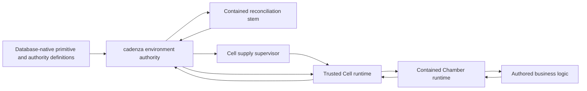

# Cadenza Workspace Architecture

## Scope

This document describes the official cross-repository architecture for the new
major-version Cadenza direction. The workspace root owns governance,
language-neutral contracts, decisions, and coordination only. Product runtime
code lives in independent child repositories.

`cadenza-service`, `cadenza-db`, `cadenza-engine`, demo repositories, and
current UI/integration experiments are legacy or exploratory reference. They
do not own current contracts and are not compatibility constraints.

## Choose A Reading Path

- **Orientation:** start with the
  [visual atlas](./architecture/atlas/README.md), then read the intended whole
  below and the [system planes](./architecture/atlas/rendered/03-system-planes.svg).
- **Application author:** use the
  [application-author guide](./guides/application-author.md),
  [graph behavior](./architecture/atlas/rendered/07-graph-behavior.svg), and the
  [reference walkthrough](../cadenza-reference-system/docs/walkthrough.md).
- **Runtime or security contributor:** use the
  [contributor guide](./guides/contributor.md),
  [runtime-operator guide](./guides/runtime-operator.md), and
  [security model](./security/cadenza-security-model-v1.md), then descend from
  the atlas into cited contracts and executable proofs.

## Intended Whole

Cadenza reduces accidental software complexity so humans and agents can focus
on intended application function: the logical flow and the business logic of
individual tasks. Primitive graphs express coordination while the environment
absorbs materialization, authority, containment, deployment, distribution,
scale, evidence, and recovery without exposing those mechanics in authored
business logic.

The complete standard is documented in
[cadenza-intended-whole.md](./cadenza-intended-whole.md).

## Official Repositories

- `cadenza` owns TypeScript primitive semantics, local graph execution, and
  neutral runtime-evidence production. It is persistence- and
  environment-authority-agnostic.
- `cadenza-python`, `cadenza-elixir`, and `cadenza-csharp` express the neutral
  primitive core idiomatically under shared conformance. TypeScript authority
  does not imply literal API identity across languages.
- `cadenza-environment` owns environment genesis, durable authority/security
  operations, PostgreSQL adapters, reconciliation, runtime-convergence
  authority, supply, evidence-ledger processing, and distributed actor
  authority. PostgreSQL is an adapter, not the identity of the environment.
- `cadenza-chamber` owns the Rust Chamber runtime substrate: activation,
  immutable runtime images, the neutral adapter protocol and artifact format,
  language-adapter integration packages, primitive ingress, normalized
  outcomes, and runtime evidence. Its TypeScript adapter consumes the official
  TypeScript core; core never imports Chamber behavior. Chamber does not own
  primitive semantics, durable adapter approval, containment, or placement.
- `cadenza-cell` owns the Rust trusted local runtime substrate: measured
  containment, launch and process custody, capability brokers, autonomous
  Chamber convergence, route interpretation, authenticated peer transport,
  execution-evidence custody, and pre-enrolled local Cell supply supervision.
  It does not own durable desired state or placement policy.

Contract authority is mapped in [contracts.config.json](../contracts.config.json).

Adapter artifacts are independently versioned and locked within Chamber.
Environment authority approves their exact identity and digest for an image,
while Cell provides containment, process custody, resource enforcement, and
mediated capabilities. Co-location under Chamber is the default until a future
adapter proves that an independent release and stewardship boundary serves the
whole better.

## Runtime Relationships

The relationship is deliberately not one generic control plane:

1. Authors declare primitive graphs and desired application shape.
2. PostgreSQL serializes semantic authority and immutable consequences.
3. The contained stem interprets desired state into canonical plans and exact
   actions through Cadenza primitives.
4. The supply supervisor realizes only pre-authorized local Cell process
   dispositions from pinned profiles.
5. Each Cell interprets current local authority, owns Chamber custody, and
   derives local or peer routing.
6. Each Chamber materializes already controlled callables and executes
   primitive behavior without receiving deployment topology or host providers.
7. Signed observations and layered evidence return interpretable state upward.

## Authority Boundaries

- Definition is serialized authority. Callable source is materialized only in
  a controlled Chamber environment; core repositories materialize primitives,
  not callable strings.
- Core repositories may report bounded authority context supplied with a
  definition or execution grant. They do not discover, evaluate, persist, or
  mutate durable environment authority.
- PostgreSQL authority operations are literal capability surfaces, not generic
  SQL or CRUD APIs.
- A committed desired-state, placement, or supply transition is not proof that
  its runtime consequence occurred.
- Stable enrollment identity and ephemeral process-generation identity remain
  distinct. Peer TLS credentials are enrollment-scoped; signed protocol,
  routing, replay, and evidence remain generation-scoped and verify exact
  current authority before affect.
- Activation grants authorize admission. Independent signed containment and
  current assignment/runtime authority govern an already admitted Chamber.
- Cells and supply providers hold credentials and host objects outside Chamber
  payloads, graph context, evidence, and logs.
- Cadenza extends feature behavior through its own primitives. Cell and Chamber
  substrate code is ordinary low-level runtime code whose purpose is to enable
  safe primitive execution.

## Evidence And Interpretation

The architecture keeps task/signal execution, graph execution, distribution,
transport attempts, runtime custody, and overarching trace identity distinct
but causally related. Evidence describes identity, phase, consequence, and
normalized outcome without storing raw business context, credentials, profile
bodies, commands, or private keys.

Canonical JSON is the shared cross-language and cross-process contract format.
Relational PostgreSQL tables remain the durable authority model; JSONB is used
for bounded canonical contracts where preserving whole payload identity is
useful, not as a substitute for relational structure.

## Direction Of Travel

The file repositories are a bootstrap and runtime foundation for an
increasingly database-native Cadenza:

1. Keep only code that must exist before or outside the environment in files.
2. Express feature extensions as database-resident Cadenza primitive slices.
3. Keep low-level Cell and Chamber runtime implementation outside the rule that
   Cadenza extends feature behavior through Cadenza.
4. Preserve the same primitive and authority model from one machine to a
   distributed environment; scale changes topology rather than the authored
   mental model.
5. The distributed actor lifecycle is complete. Keep feature development
   frozen for the whole-system stabilization and GitHub publication milestone
   before adding expansion features.
6. Add generated expansion and the general security/plugin lifecycle before
   Memory; Memory is the first official plugin, not runtime substrate.
7. Provide one open-source read-only observer before Memory so internal state
   and evidence are visibly interpretable without granting mutation authority.
8. Keep the final mutating UI, agent integration, cloud control, and
   multi-environment management in the separate managed-product track.
9. Keep CLI work outside current priorities rather than importing legacy
   implementations.

## Related Documents

- [Workspace map](./workspace-map.md)
- [Cadenza environment](./cadenza-environment.md)
- [Language role doctrine](./cadenza-language-role-doctrine.md)
- [Language runtime contract](./cadenza-language-runtime-contract.md)
- [Cell peer transport](./contracts/cell-peer-transport/v0.md)
- [Completed Sprint 7 design](./agent-harness/exec-plans/completed/2026-07-17-scale-placement-reconciliation-design.md)
- [Completed Sprint 8 distributed actor design](./agent-harness/exec-plans/completed/2026-07-20-distributed-actor-lifecycle-sprint-8-design.md)
- [Sprint 9 stabilization and publication design](./agent-harness/exec-plans/active/2026-07-21-distributed-foundation-stabilization-publication-design.md)
- [Distributed foundation publication and product boundary](./decisions/2026-07-20-distributed-foundation-publication-and-product-boundary.md)
